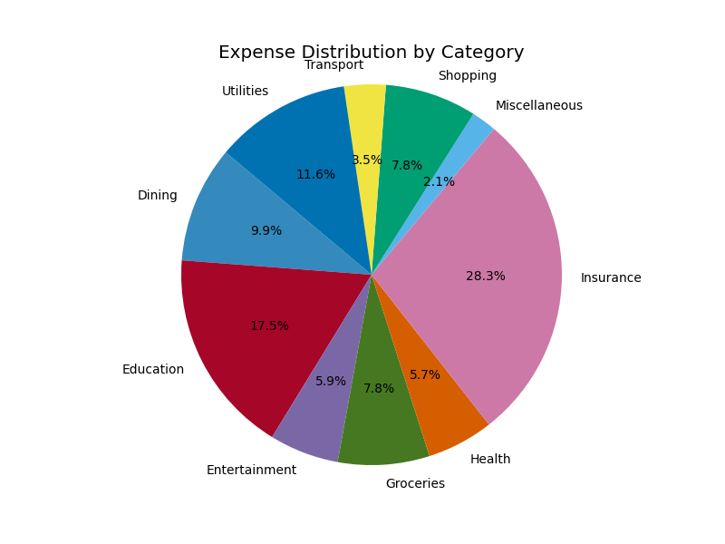
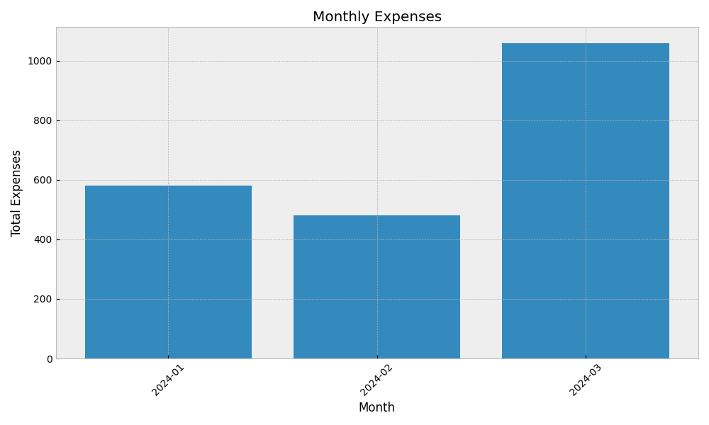

# Expense Tracker


## Overview

The **Expense Tracker** is a graphical application built with Python and Tkinter, designed to help users manage their expenses efficiently. It utilizes SQLite for data storage and offers an intuitive interface for adding, categorizing, and analyzing expenses. Whether for personal use or small business needs, this tool aims to simplify expense tracking and financial management.

## Features

- 📊 **Expense Management:**
  - Add, edit, and delete expenses with details such as amount, date, category, and notes.
  - Categorize expenses for better organization and analysis.

- 🗃️ **Data Storage:**
  - Uses SQLite database to store expense records securely locally.
  - Provides robust data management capabilities through SQL queries.

- 📅 **Date Filtering:**
  - Filter expenses by specific dates to view transactions within a specified timeframe.

- 📈 **Expense Analytics:**
  - Generate summaries and visual representations (charts/graphs) of expenses over time or by category.
  - Gain insights into spending patterns for informed financial decisions.

- 🎨 **Customizable Interface:**
  - User-friendly GUI built with Tkinter, offering a responsive and customizable experience.

- 📄 **Export Functionality:**

  - Export detailed expense reports in PDF, CSV, or SQLite formats for comprehensive financial analysis and reporting.
  - Easily share and archive expense data to facilitate collaboration or record-keeping. 


## Future Development

🚀 **Under Development**

The Expense Tracker is continuously evolving with planned features to enhance functionality and user experience:

- **Budget Planning:** Set budgets and receive alerts when nearing or exceeding limits.
- **Cloud Integration:** Synchronize data across devices and cloud storage for accessibility.
- **Data Insights:** Incorporate machine learning for predictive analytics and spending behavior analysis.
- **Multi-user Support:** Enable multiple user profiles with secure login and personalized settings.
- **Expense Reminders:** Schedule reminders for upcoming bills or recurring expenses.
- **Localization:** Support for multiple languages and currency formats for global usability.

Stay updated with our roadmap and contribute to shaping the future of Expense Tracker by opening issues or submitting pull requests. Your feedback and ideas are crucial for improving the tool!

## Getting Started

### Prerequisites

- 🐍 Python 3.x installed
- 🖼️ Tkinter library (usually included with Python installations)
- 🗄️ SQLite3

### Installation

1. **Clone the repository:**
   
```
   git clone https://github.com/yourusername/expense-tracker.git
   cd python-env-tool
```

2. **Install dependencies:**
   
```
   pip install -r requirements.txt
```

3. **Setup the SQLite database:**
   
```
   python setup_db.py
```

### Usage

1. **Run the application:**

```
    python gui.py
```


. **Explore functionalities:**

- 📅 **Filter by Date:** Use date selectors to view expenses within a specific period.
- 📊 **View Reports:** Analyze expenses with graphical representations.
- 📝 **Add/Edit Expenses:** Input new expenses or modify existing ones easily.
- 📄 **Export Reports:** Export detailed expense reports in PDF or CSV formats.

## Sequence Diagram

[](https://mermaid.live/edit#pako:eNrVVstu2zAQ_BWCJwew0bsOAQq3KXIIGqR1TgKEDblSiEikSlJOjSD_XlIPS7Zkq3aUAPHBkLnUzuzMeskXyhRHGlCDfwqUDL8JSDRkoSTuk4O2gokcpCUrg7q_-v1vjtLgbw3sCfW9wOexPUslrVZpeiTbjaOU9qO3GmPUnqQJZRX2pBaXl30WAfnpl5qMpA5VbwGzYg0WB9lXW_qRHkxbSEDuvHrGEuayJkoLz_AI0r4Gh6KLA7Ut92A4_gfQqGJfOTdE4jPBKniWEveQCu6JgOTEwBqbbI6kBZFOJMyWQtkrAQHOoxpoBpkqpJ03ZmzmxBNy32iYFrkVSl4Ms-g0XndlcbTipsV8sZwwJWOhM_Aoh8zpwEzj3JVILWrTSG3Iw2ZbfWmEF-BNjR2XCK6-BuJ9bEzQNjaa2ZQmXQ3z_wBvagW35hCNudLWnGXHD5SoPaEqyScz4a4k7ZsRPkz-G5CQuH9EO5nJzA2LLxoztcaLIy50jpvmNNk5gXZk6UU6Cz2BUwU8aglFsVZZxB_O0HqH4_ipUGcaZ-jHaTNAZs3DNPQ2Pvlpg3Kcb-Xm-1Gu8r-R9IEOXeXledlp0NV1L_dpd59lqvwpMHj5OXHilKl83RJZW_XUI4d5lKhFmXTsLLdpKxw-7fAZENTR8e4E-w6M4HdS0DnN0DWa4O5u_uJfCKl9xAxDGrhHDvoppKF8dfugsOrXRjIaWF3gnGpVJI80iCE17ldRdld9q69XX_8BK2dV6Q)

## Entity-Relationship Diagram

[](https://mermaid.live/edit#pako:eNpNj0EKwyAQRa8is-4J3EljaWlJQyIlCzeiNpFWDUYXIeTuNW0g_av5b4aZPzNIrzRg0KEwogvCcoeyaFvRsqFo_tlVRqFLyVB13ZGwPrmITrc7YTuVIurOhwk9SH08k3rvqNxBBWH0D-lRBjNE4x1itN3WLHAAq4MVRuVs3xAcYq-t5oBzqUR4ceBunRMp-mZyEnAMSR8g-NT1gJ_iPWaXhvXo9ttGlw-540nm)


## Visualizations

### Expense Distribution by Category



### Monthly Expenses



## Full Expense Report

For a detailed expense report, view the [PDF report](data/pdf.pdf).


## Contributing

Contributions are welcome! Please feel free to open issues or submit pull requests for any improvements or additional features you'd like to see in the Expense Tracker.

## License

This project is licensed under the MIT License. See the [LICENSE](LICENSE) file for details.
